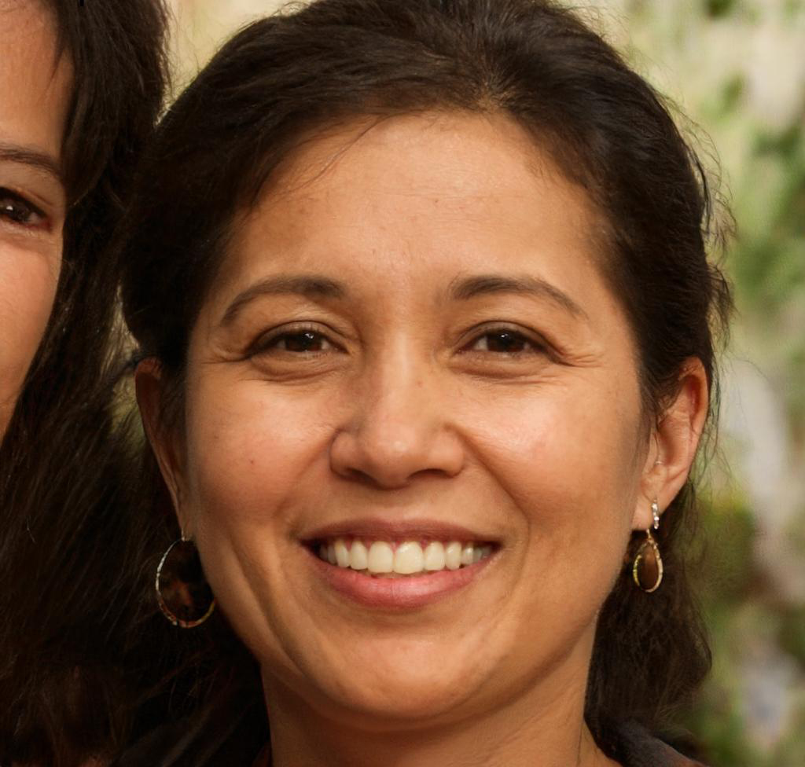

# Persona 2:

## Name: 
Eva Karina

## Age: 
48

## Image:

## Occupation:
Personal Care and Service Worker

## Background: 
Eva was born in Sacramento, as the youngest child to a family of six, but while still young her family moved out to Colorado where there was work for her father and mother to support their family.
Moving to a quieter town on the outskirts of Denver, it was not quite the big city they were all used to but they all soon would call it home, especially for Eva who fell in love with Colorado so much that she couldn't help but setup roots in the state with a family of her own one day. One of the many reasons why she loved it so much is all the rock climbing she did in her youth and the plentiful and beautiful spots within the state. Even at age 48, her enthuiasm has not wavered as she has even passed down her loved for rock climbing to her children.

## Rock Climbing Expertise:
Eva has been rock climbing for decades, ever since she was a teenager, and while she has attempted a couple of the more challenging routes and boulders when she was young, Eva — as a parent of three — refrains from anything risky nowadays. Even when she was young, she always viewed the sport from a casual entertainment perspective rather than something to strive to be the very best at.

## Tech Skills:
Eva has never been one for technology, and while she could've spent some time picking up computer skills when she was younger, Eva was always more keen on physical activities and being active rather than spending time at a computer. She is by no means completely tech-illiterate, though, as her children have taught her some tech device basics over the years. Still, if whatever she's using is too complicated or doesn't ease her into using the app, she may end up giving up altogether.

## Community Involvement:
Eva is active in her community and loves bringing herself and her family to and participating in community events and participating. However, while she has heard of rock climbing events, she has never participated in them herself as she was always used to going in small groups of friends or family. Eva also volunteers on the odd day she is completely free from her responsibilites at work and with her family.

## Location Knowledge:
Eva, being a veteran rock climber, has multiple times been to most of the rock climbing spots all across and around the state of Colorado. She takes pride in her intimate insider knowledge on most of the popular areas as well as some of the lesser known ones.

## Personality:
Eva's bubbly extroverted nature wins over anyone she manages to reach within earshot. She relishes being able to find people who share her passion for the sport, doubly so if she manages to come across someone on the way in or out of the climb. She goes rock climbing a lot with others because she enjoys teaching or sharing the experience with others.
