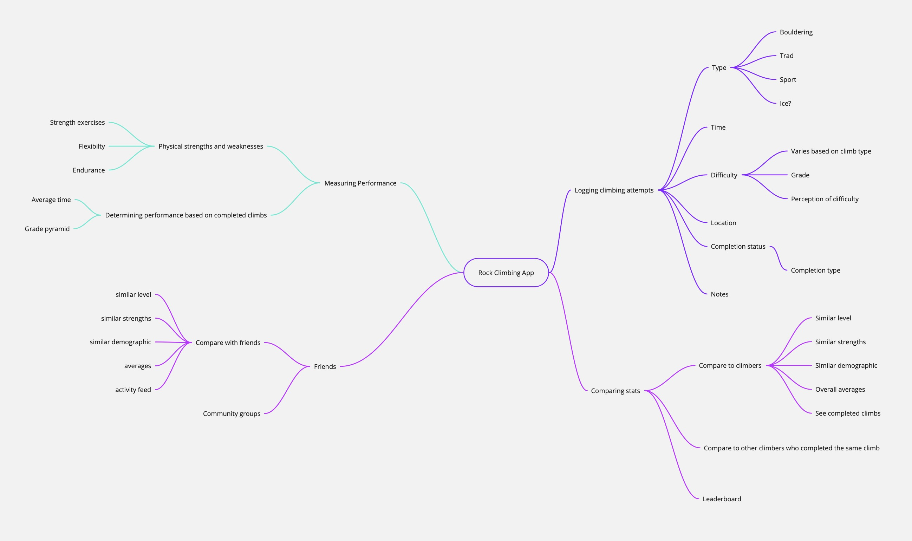
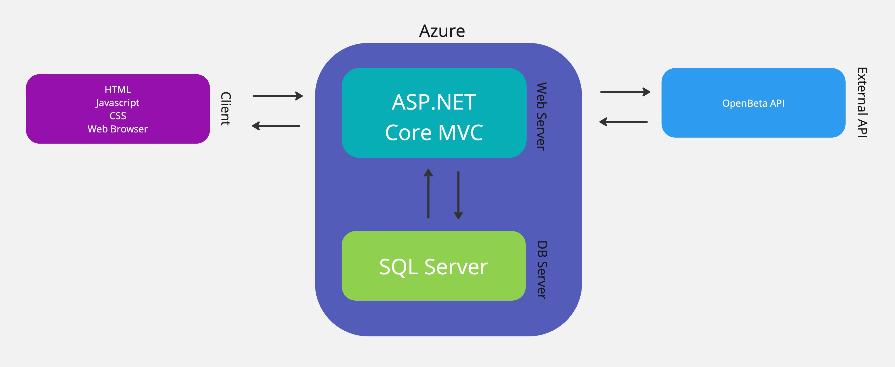

Project Inception Worksheet
=====================================

An app to allow users to track and quantify their strengths, weaknesses, and achievements. To help them better understand their strengths and weaknesses by comparing their stats and achievements to other climbers in an objective way. Analyzing trends in users, as well as determining averages for numerous aspects of performance in individuals in the many different levels in climbing. This information can be crucial to high performance focused athletes to help them understand their shortcomings, as well as everyday recreational users who like to track their progress and see how they compare to their friends. This can become very scalable as the system would become more refined and specific to individuals as more data is collected.

## Name
PeakPals

## Summary of Our Approach to Software Development
What processes are we following?  How will we run this project? ==> Agile, Scrum, ...  
What are we choosing to do, how will we do it and at what level of detail or extent?

## 2: Initial Vision Discussion with Stakeholders
A web app that allows users to track and view their strengths, weaknesses, achievements, and view a variety of climbs with comparative data from the community. By comparing a user's individual statistics to others, they will have the context to view themselves as a climber accurately and be able to improve efficently with that knowledge. Giving objective, comparative data points to climbers that will allow them to observe how their performance and objective measurements may align and differ relative to what may be expected of someone in their demographic, skill, and experience level. The app will allow users to log their climbing attempts on a wide range of climbs, measure their performance on their attempts, and compare the stats gained from the previous two and compare them with others who attempted the same climb — as well as comparing them with friends that you can make on the app. This app is aimed to fill a need for climbers to track their own rock climbing skills, allow them to find climbs at their level, and have a way to compare themselves to others accurately. The ability to compare objective measurements that are indicitive of a climbers performance, for not only general demographic, skill, and experience level. But as for comparisons down to such specifics as climbers on the very same routes, becomes an exceptionally important tool for measuring progress and performance of individuals across all levels of the sport. For tracking and comparing data for rock climbing, there isn't a lot of data that's open source and available to the public. For example, OpenBeta has tons of routes, but it doesn't have much in the way of giving context with personal and community data. This app seeks to bring the contextual and objective measurements that can help give guidance to an indivudals choices when it comes to training and climbing, to each individual, through building a strong community. As this system becomes more refined and detailed as the community size and diversity increases.

[Miro Link - Editable Mindmap](https://miro.com/app/board/uXjVN4Aend4=/)

### Description of Clients/Users
- [Persona 1](Persona_1.md)
- [Persona 2](Persona_2.md)
- [Persona 3](Persona_3.md)

### List of Stakeholders and their Positions (if applicable)
1. Recreational Rock Climbers: This stakeholder is a casual, recreational climbers who represents the average majority of the userbase that will be using the application.
2. Rock Climbing Associations: Portland Area Climbers Coalition leaders / members: Social community groups that bring people together for rock climbing and help build and preserve climbing access for the climbing community. PeakPals could help these communities spread the word about local climbing routes and events more effectively. 
3. Rock Climbing Gyms: Rock climbing gyms will be affected through the gyms community interactivity that the app will create. 
4. Coaches: Can use PeakPals to help clients track fitness growth and performance, elevate the personal advice and exercise recommendations that they provide, and even recommend appropriate climbing routes discovered through the app.
5. Pro Rock Climbers: Pro rock climbers can benefit from the analysis tools that the app will provide to allow them to determine areas that they need to improve upon to insure that they are not lacking in any areas.
6. Software Developers: The team building this application and running the project has of course a strong interest in the project's success and be ultimately affected by it.
7. Project Advisor (Dr. Morse): Advisor to the developers working on the project, helps guide and evaluate project development.

## 3a: Initial Requirements Elaboration and Elicitation
1. It is required for user's to log their climbs and for it to persist.
2. It is required for the user to see climbing locations.
3.

### 3c: Elicitation Questions
1. What information will we need to track for a user's performance on climbs?
2. What analysis will a user get for their climbing performance?
3. How will user's be able to compare their performances to others?
4. How would you find climbing locations?
5. Will there be a leaderboard system to compare my data to others?
6. Will I be able to add friends to my account?
7. Will I be able to compare with my friends' data?
8. Can I organize community groups?
9. Will I be able to track my physical strengths? And how will it be broken down?
10.   

### Elicitation Interviews
[Requirements & Elicitation Discussion](/Requirements%20&%20Elicitations%20Page.md)

### Other Elicitation Activities?
As needed

## 3b: List of Needs and Features
### Needs:
1. Eva is a busy, tech-adverse mother that needs a easy to get connected to her local rock-climbing community so that she can fulfill her desire to rock climb with others.
2. Alex is a skilled software engineer and an rock climbing enthusiast that needs to get accurate statistical analyitics of his climbing attempts so that he can take his climbing skill to the next level.
3. Emily is an environmental scientist and community leader who needs an intuitive way to get information about climbs in her area so that she can find new challenges to take with her community.
4. Alex as someone who wishes to push his climbing to the next level needs a way to compare his statistics to other climbers so that he can optimizatize his training.
### Features:
1. Log climbing attempts
2. View individual locations
3. View data for each climb
4. Compare a user's stats compared to others
5. Compare with people who completed the same climb
6. View a leaderboard of recent climbing activities
7. Account/Login system
8. Friending System
9. Community Group System
10. See a user's statistics
11. User's get an analysis based on their attempts
12. Responsive webpages with fast-load times.
13. Intuitive UI/UX
14. User's can easily log their information
15. User's can identify and analyze thier own stats.
16. Accounts and identity information are secure.

## Initial Modeling

### Use Case Diagrams
Diagrams

### Sequence Diagrams

### Other Modeling
Diagrams, UI wireframes, page flows, ...
[Page mockups](/page%20mockup%20drafts.pdf)

## Identify Non-Functional Requirements
1. 
2.
3.

## Identify Functional Requirements (In User Story Format)

E: Epic  
U: User Story  
T: Task  

1. [E] Initial Application Setup
2. [E] User Accounts & Login
3. [E] Fitness Statistics, Comparison, and Analysis
4. [E] Searching and Exploring Routes
5. [E] Logging and Storing Climbing Attempts
6. [E] Profile Page with Bio, Statistics, and History
7. [E] Groups / Communities

<!-- Format -->
7. [E] 
    1. [U]
        a. [T]
        b. [T]
    2. [U]
        a. [T]

## 4: Initial Architecture Envisioning

[Miro Link - Editable Architecture diagram](https://miro.com/app/board/uXjVN3ILmfA=/)

## Agile Data Modeling
Diagrams, SQL modeling (dbdiagram.io), UML diagrams

## Timeline and Release Plan
[Timeline and Release Plan](/Project%20Timeline.html)