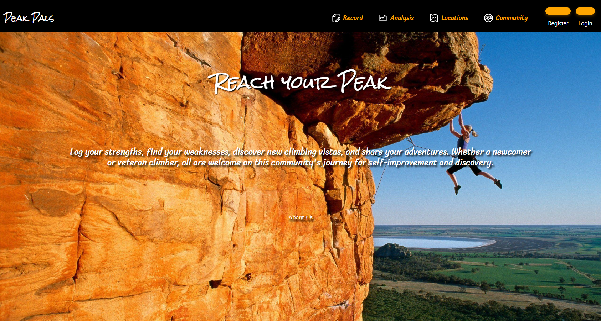
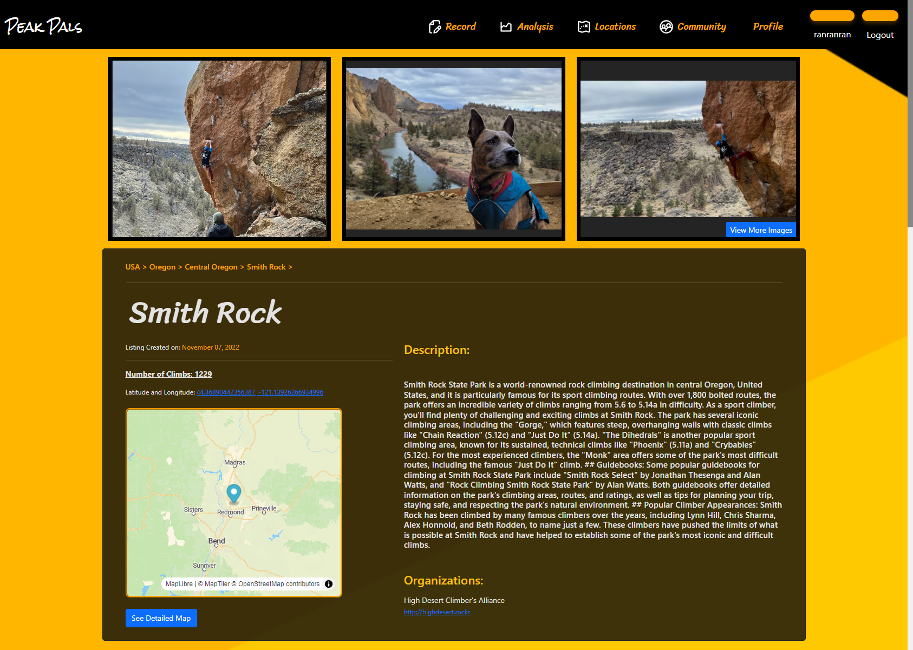
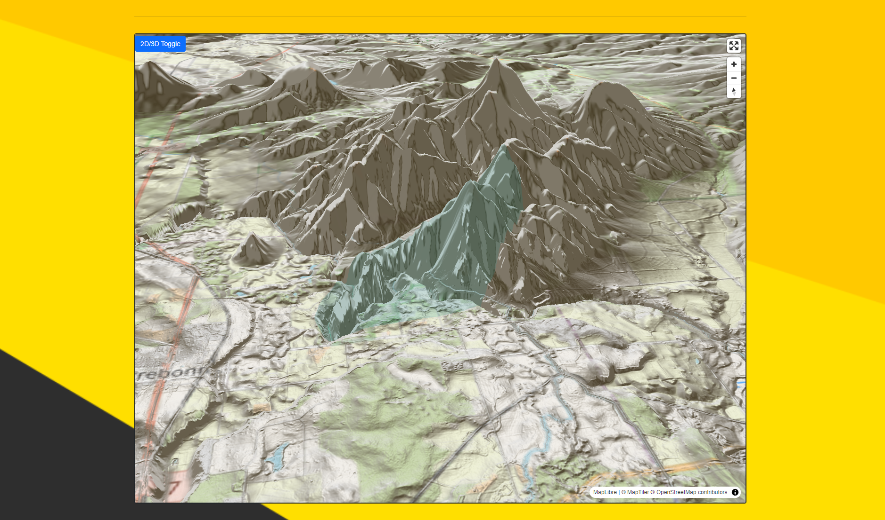

<h1 style="text-align: center;"> Peak Pals </h1>

<h3 style="text-align: center;"> <b>Senior Capstone Project</b> for Western Oregon University</h2>

### **Contributors:** <a href="https://github.com/Bentoboxing">Patrick Iannotti</a>, <a href="https://github.com/TommySegovia">Tommy Segovia</a>

#### The repository for Peak Pals, a web application dedicated to rock climbers who are looking to seek ways to track their abilities, find ways to improve themselves, and discover new climbs out in the world! 
 
## Find our site here: https://peakpal.azurewebsites.net/

### APIs Used: GraphQL, OpenBeta, Scottplot, Sendgrid, MapLibre
#### Building this repo locally won't require API Keys. However, it will require one's own seperate database to function.

